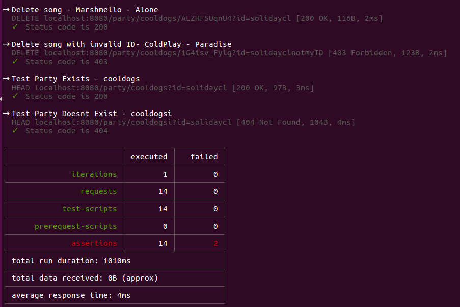

# Server Testing
Server tests are created using [postman](https://www.getpostman.com/) and ran using the [newman](https://www.getpostman.com/docs/v6/postman/collection_runs/command_line_integration_with_newman) collection runner. We chose to use postman over other testing frameworks for its ease of setup and its ability to quickly make tests while using it as a development tool. Tests are ran locally before pushing changes to the server.

### Prerequisites
* Go 1.6
* Postman 
* Newman

### Run the Tests
First run the server in the background:

	go run Server/Server.go& 

Then run the newman collection runner on the postman collection:

	newman run Server/CDT_API.postman_collection.json 
	
Upon completion, the server process should be killed before runnning another test.

The output should be resemble the following:

This testing framework is also used to populate the server with data for manual tests. 

	newman run Server/PopulateServer.json 

# App Testing

We are testing our app's features manually.  Every time we make an addition, we make sure that it does not break any previous work.

### Manual Test #1 Host Party
When the app is launched, the user can Host a party.  They should enter a name for the party and create it. If the user enters an invalid name, the app should notify them and allow them to try again.  If the server is overpopulated, the user should be notified. The host's phone should then load the YouTube player which should then wait for YouTube video IDs to be added to the list.  The host's name should be added to the list of users connected to the party and they should be able to see the current list of songs, the users connected to the party, along with the ability to add songs/videos.

### Manual Test #2 Join Party
When the app is launched, the user can join a party.  They should enter the name of a party.  If they enter the name of a party that does not exist, they should be notified and be allowed to try again.  Once they join the party, their name should be added to the list of users connected to the party. They should be able to see the current list of songs, the users connected to the party, along with the ability to add songs/videos.

### Manual Test #3 YouTube Player Functionality
The YouTube player should pull the first video ID in the list, remove it from the list, and load the video and play it.  If list is empty, it should not do anything and wait for an ID to be added.  Once the YouTube player finishes the current song/video, it should should pull the next video ID in the list, remove it from the list and load and play the video.

### Manual Test #4 Manually Adding Songs/Videos
Once a user is in a party, they should be able to add songs/videos to the list. Currently the app supports loading the YouTube player by manually entering video IDs (located at the end of the YouTube url).  If an invalid ID is entered, it should notify the user.

### Manual Test #5 YouTube Search
Once a user is in a party, they should be able to search for a song/video by entering a string.  The user should be presented with the top 5 most viewed YouTube videos matching the entered string, with a number next to them.  The user should be prompted to enter a number corresponding to the song/video they want, and it's video ID should be added to the list.  If the user enters a number that is out of the range, they should be notified and allowed to try again.

### Manual Test #6 Google Sign in
If the user is not already signed in with their Google account, they should be presented with a list of Google Accounts linked to their phone to sign in with.

### All Manual Tests
No features added should make the app crash.  If after a new feature is added and it does make the app crash, that feature is logically tested to find the source of the bug.
